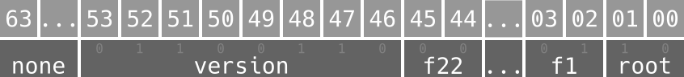

# Zerializer

*Zerializer* is a Scala based binary serialization library, it uses [DataInput](https://docs.oracle.com/javase/8/docs/api/index.html?java/io/DataInput.html "See javadoc") and [DataOutput](https://docs.oracle.com/javase/8/docs/api/index.html?java/io/DataOutput.html "See javadoc"). So, let's code!

**Important**! *Zerializer* is not a data exchanging serialization library, *Zerializer* is a simple approach to serialize your objects within your application.

First we need to import:

```scala
import com.github.rthoth.zerializer._
```

## Case Classes

Case classes can to simplify your work, because they provide some *magic methods* like **apply** and **unapply**. But *Zerializer* does not force you to use **case classes**.

```scala
  case class User(name: String, email: String, age: Int, active: Boolean)

  implicit val userSerializer = new ComposedBuilder()
    .field[String]
    .field[String]
    .field[Int]
    .field[Boolean]
    .build(User.apply, User.unapply)
```

If you want to code your own functions, you can do this:

```scala
val ownUserSerializer = new ComposedBuilder()
  .field[String]
  .field[String]
  .field[Int]
  .field[Boolean]
  .rw {
    (name, email, age, active) => User(name, email, age, active)
  } {
    user => if (user != null)
      Some((user.name, user.email, user.age, user.active))
    else
      None
  }
```

As you can see, we are using implicits arguments for each **field** method invocation.

## Complex objects serializers.

In the sample above we declared *userSerializer* as an implicit value, we did it because we are going to create another serializer that uses *userSerializer*.

First we need define a new class.

```scala
  case class Sale(id: Long, cost: Double, owner: User)
```

And now...

```scala
  val saleSerializer = new ComposedBuilder()
    .field[Long]
    .field[Double]
    .field[User]
    .build(Sale.apply, Sale.unapply)
```

Every `Zerializer` has the follow signature:

```scala

trait Zerializer[-I, +R] {

  def emptyValue: R

  def isEmpty(value: I): Boolean

  def read(input: DataInput): R

  def read(bytes: Array[Byte]): R = {
	...
  }

  def read(input: InputStream): R = {
    ...
  }

  def write(value: I, output: DataOutput): Unit

  def write(value: I): Array[Byte] = {
    ...
  }

  def write(value: I, output: OutputStream): Unit = {
    ...
  }
}
```

We can use our serializer as the samples bellow:

```scala
	val user = User("Albert", "e@m.c2", 50, true)

	userSerializer.write(user, new FileOutputStream("user-01"))

	assert(userSerializer.read(new FileInputStream("user-01")) == user)

	val sale = Sale(599, 0.56, user)

	saleSerializer.write(sale, new FileOutputStream("sale-01"))

	assert(saleSerializer.read(new FileInputStream("sale-01")) == sale)
```

## Maps and Traversables

It is very common, Yeah! okay it's necessary, serialize `Maps` and `Traversables`. How do it?

```scala
  case class Element(name: String, number: Int, family: String, electrons: List[Int])

  case class PeriodicTable(name: String, elements: Queue[Element], elementByNumber: SortedMap[Int, Element])

  implicit val elementZerializer = new ComposedBuilder(Some(120))
    .field[String]
    .field[Int]
    .field[String]
    .field(traversableZerializer[Int, List[Int]])
    .build(Element.apply, Element.unapply)

  implicit val periodicTableZerializer = new ComposedBuilder(Some(20))
    .field[String]
    .field(traversableZerializer[Element, Queue[Element]])
    .field(mapZerializer[Int, Element, SortedMap[Int, Element]])
    .build(PeriodicTable.apply, PeriodicTable.unapply)

  val hydrogen = Element("Hydrogen", 1, "IA", 1 :: Nil)

  val oxygen = Element("Oxygen", 8, "VIA", 2 :: 6 :: Nil)

  val table = PeriodicTable("My Table", Queue(oxygen, hydrogen), SortedMap(8 -> oxygen, 1 -> hydrogen))

  periodicTableZerializer.write(table, new FileOutputStream("target/table"))

  val tableSerialized = periodicTableZerializer.read(new FileInputStream("target/table"))
  assert(tableSerialized == table)
```

In the sample above `Composed Zerializer` has version information.

## Self serializing

it's also very common an object to contain fields of the same type and if you would like to use the same *zerializer*? For this propose *Zerializer* has a special zerializer called `LazyZerializer`.

```scala
  case class Tag(name: String, attributes: Map[String, String], children: Seq[Tag])

  implicit val tagZerializer = {
    var ret: SimpleZerializer[Tag] = null

    implicit val serializer = lazyZerializer(ret)

    ret = new ComposedBuilder()
      .field[String]
      .field(mapZerializer[String, String, Map[String, String]])
      .field(traversableZerializer[Tag, Seq[Tag]])
      .build(Tag.apply, Tag.unapply)

    ret
  }

  val html = Tag("html", Map("lang" -> "pt_BR"),
    Tag("head", Map.empty, Nil) :: Tag("body", Map("onLoad" -> "null"), Nil) :: Nil)

  tagZerializer.write(html, new FileOutputStream("target/tag"))
  val serializedTag = tagZerializer.read(new FileInputStream("target/tag"))
  assert(serializedTag == html)
```

## Built-in

Scala has classes like `Option`, `Try` and `Either`. They are useful on many situations and *Zerializer* has special *serializers* for them.

```scala
  case class Essay(title: String, author: String, content: Option[String], approved: Try[Boolean], score: Either[String, Int])

  val essayZerializer = new ComposedBuilder()
    .field[String]
    .field[String]
    .field[Option[String]]
    .field[Try[Boolean]]
    .field[Either[String, Int]]
    .build(Essay.apply, Essay.unapply)

  val essay = Essay("My little star!", "!!!", None, Failure(new IllegalStateException("Ouch!")), Left("I don't like it"))

  essayZerializer.write(essay, new FileOutputStream("target/essay"))
  val serializedEssay = essayZerializer.read(new FileInputStream("target/essay"))

  // == does not work on Throwable!
  val Failure(serializedEssayCause) = serializedEssay.approved
  val Failure(essayCause) = essay.approved
  assert(serializedEssayCause.getStackTrace.mkString == essayCause.getStackTrace.mkString)
  assert(serializedEssay.content == essay.content)
  assert(serializedEssay.score == essay.score)
```

## How does it work?

`ComposedBuilder` is a builder to create a `ComposedZerializer`, and this is a special `Zerializer` that has own binary format. The `ComposedZerializer` format has a header which is composed by a long64 field.

```c
ComposedFormatN { // N between 1 to 22
	signed long64 header;

	byte[] field1;
	...
	byte[] fieldN;
}
```

## Composed Header

The header field describes how to deserialize the root object and which fields should or should not to be read. And it also have a reserved space to store the serialization version. The follow image describes how it works.



Where:

* **root** is your object information.
* **f1** to **f22** are the fields information.
* **version** is a byte serialization version.

For each field space and root object there are 2 bits to describe how to deserialize each object. Supported values are:

* **Not Empty** = 0x2
* **Empty** = 0x1
* **Null** = 0x0

Remember, Scala supports 22 function arguments and `Composed Zerializer` also supports 22 fields.
